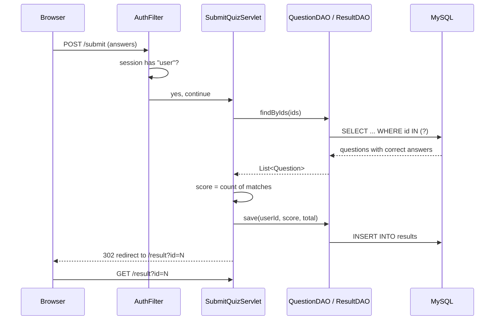

# Architecture - Online Quiz System

A classic **MVC web application** on Java Servlets, JSP, JDBC and MySQL, deployed as a WAR on Apache Tomcat 9.

## 1. Big picture

```
 Browser
   |  HTTP request
   v
+-----------------------------------------------------------+
|  Tomcat 9                                                 |
|                                                           |
|   Filters     AuthFilter  ->  AdminFilter   (Module IV)   |
|      |                                                    |
|      v                                                    |
|   Controller  Servlets  (login, quiz, submit, admin...)   |
|      |                       |                            |
|      |  forward              |  calls                     |
|      v                       v                            |
|   View        JSP + JSTL     Model: DAO classes (JDBC)    |
|   (WEB-INF/views)                 |        (Module II)    |
+-----------------------------------|-----------------------+
                                    v
                                 MySQL (quizdb)
```

Request flow in one line: **JSP form -> Filter -> Servlet -> DAO -> MySQL -> back to Servlet -> JSP**.



## 2. Layers and responsibilities

| Layer | Package / folder | Job | Does NOT do |
|---|---|---|---|
| View | `webapp/WEB-INF/views/*.jsp` | Draw HTML from data given by a servlet | SQL, business rules |
| Controller | `com.quiz.servlet` | Read request, call DAO, choose the view or redirect | Write SQL |
| Filter | `com.quiz.filter` | Check login and role before a servlet runs | Page content |
| Model | `com.quiz.model` | Plain Java objects (User, Question, Result) | Database calls |
| DAO | `com.quiz.dao` | All JDBC code, PreparedStatement only | HTTP, sessions |
| Util | `com.quiz.util` | Connection factory, password hashing | Anything page-specific |

JSPs live under `WEB-INF/`, so a browser cannot open them directly. Every page is reached through a servlet.

## 3. Folder structure

```
quiz-app/
|-- pom.xml                          Maven build (WAR, Java 11)
|-- README.md                        How to run
|-- docs/
|   |-- architecture.md              this file
|   `-- design.md                    UI, screens, database design
|-- sql/
|   |-- schema.sql                   3 tables
|   `-- seed.sql                     5 sample questions
`-- src/main/
    |-- java/com/quiz/
    |   |-- model/    User, Question, Result
    |   |-- dao/      UserDAO, QuestionDAO, ResultDAO
    |   |-- util/     DBConnection, PasswordUtil
    |   |-- filter/   AuthFilter, AdminFilter
    |   `-- servlet/  Login, Register, Logout, Quiz, SubmitQuiz, Result, AdminQuestion
    `-- webapp/
        |-- index.jsp                redirects to /login
        |-- css/style.css
        `-- WEB-INF/
            |-- web.xml
            `-- views/  login, register, quiz, result, admin-questions, error (+ _header, _footer)
```

## 4. URL map

| URL | Method | Servlet | Who can use it | Result |
|---|---|---|---|---|
| `/login` | GET, POST | LoginServlet | anyone | login form; on success redirect to `/quiz` |
| `/register` | GET, POST | RegisterServlet | anyone | create account; redirect to `/login` |
| `/logout` | POST (GET works too) | LogoutServlet | anyone | invalidate session |
| `/quiz` | GET | QuizServlet | logged in | 10 random questions |
| `/submit` | POST | SubmitQuizServlet | logged in | score, save, redirect to `/result?id=` |
| `/result` | GET | ResultServlet | logged in | latest score and history |
| `/admin/questions` | GET, POST | AdminQuestionServlet | ADMIN only | list, add, edit, delete questions |

## 5. Mapping to the syllabus

| Module | Where to find it in the code |
|---|---|
| I - Servlet basics, optional sockets | All classes in `servlet/`. A live announcement over sockets is **future scope**. |
| II - JDBC | `DBConnection`, `QuestionDAO` (create, read, update, delete with `PreparedStatement`), `ResultDAO.save` with generated keys |
| III - Tomcat, JSP, MVC | WAR deployed on Tomcat, JSP + JSTL views, servlet forwards with `RequestDispatcher` |
| IV - Sessions, Filters, redirect | `HttpSession` in `LoginServlet`, `AuthFilter` and `AdminFilter`, `sendRedirect` after login and submit |

## 6. Key decisions

- **Scoring happens on the server.** The quiz page only sends back question ids and the chosen letters. Correct answers never reach the browser.
- **Post/Redirect/Get.** After `/submit` saves the result, the servlet redirects. Refreshing the result page cannot submit the quiz twice.
- **Session handling.** On login the old session is invalidated and a new one is created (stops session fixation). Idle timeout is 30 minutes.
- **Passwords** are stored as salted PBKDF2 hashes (JDK only), never plain text.
- **SQL injection** is avoided by using `PreparedStatement` for every query.
- **XSS** is avoided by printing user text with `<c:out>`.
- **Ownership check.** `findByIdAndUser` only returns a result that belongs to the logged-in user.
- **Admin role.** There is no admin sign-up form. Promote an account in SQL (see README).

## 7. Known limits (good "future scope" slide)

- No timer, leaderboard, or remember-me.
- A new database connection is opened per query. A connection pool (HikariCP or Tomcat JNDI `DataSource`) would be the next step.
- No CSRF token on forms.
- Database credentials are constants in `DBConnection.java`.
- Optional socket announcement from Module I is not built.
