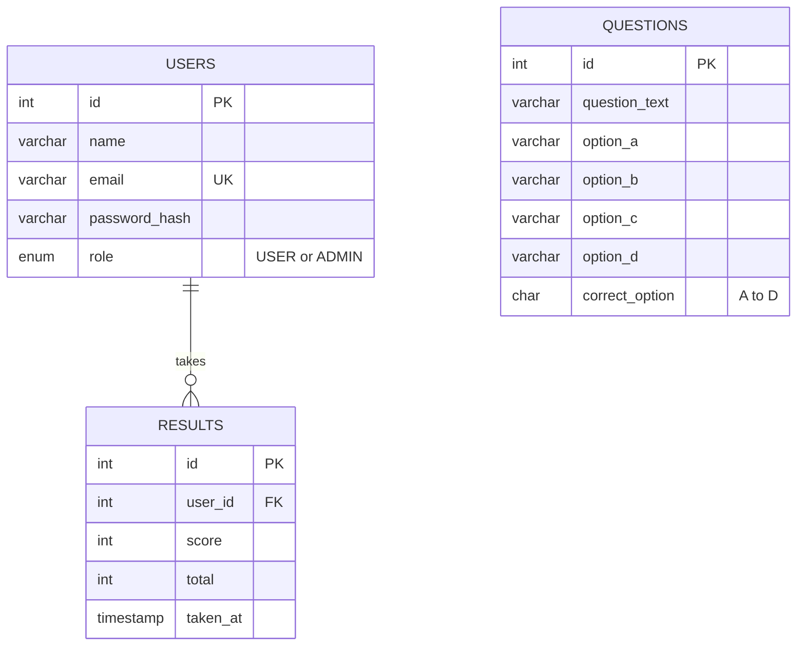

# Design - Online Quiz System

Covers the database, the screens, and the look of the UI.

## 1. Users and goals

| Person | Goal |
|---|---|
| Student | Register, log in, take a quiz, see the score, review past attempts |
| Admin | Add, edit and delete questions |

## 2. Database design

Database `quizdb`, three tables.



Notes
- `results.total` is stored with the score, so old results stay correct even if questions are deleted later.
- `ON DELETE CASCADE` on `results.user_id` removes a user's attempts with the user.
- `questions` has no link to `results`. That keeps the minimum version simple. Per-question review would need a fourth table, `answers`.

## 3. Screens

| # | Screen | File | Main content |
|---|---|---|---|
| 1 | Log in | `login.jsp` | Email, password, link to register |
| 2 | Create account | `register.jsp` | Name, email, password |
| 3 | Quiz | `quiz.jsp` | 10 questions, 4 options each, Submit button |
| 4 | Result | `result.jsp` | Big score, percent, Try again, attempt history table |
| 5 | Manage questions | `admin-questions.jsp` | Add/edit form, table of all questions with Edit and Delete |
| 6 | Error | `error.jsp` | Plain message and a link back to login |

### Flow

```
Register -> Log in -> Quiz -> Submit -> Result -> (Try again -> Quiz)
                        \
                         Admin only: Manage questions
```

### Wireframes

Quiz
```
+--------------------------------------------------------+
| Online Quiz        Take quiz  My results  Log out (Ana) |
+--------------------------------------------------------+
|  Quiz  10 questions                                    |
|  +--------------------------------------------------+  |
|  | 1  Which interface runs a precompiled statement? |  |
|  |    (A) Statement                                 |  |
|  |    (B) PreparedStatement      <- amber when picked|  |
|  |    (C) ResultSet                                 |  |
|  |    (D) Connection                                |  |
|  +--------------------------------------------------+  |
|  [ Submit answers ]                                    |
+--------------------------------------------------------+
```

Result
```
+--------------------------------------------------+
|                 8 out of 10                      |
|                 80% correct                      |
|                 [ Try again ]                    |
+--------------------------------------------------+
| Your attempts                                    |
| Date                 Score     Percent           |
| 2026-10-04 18:20     8 / 10    80%               |
+--------------------------------------------------+
```

## 4. Visual design

One idea: **answer options look like the bubbles on an exam answer sheet.** Everything else stays quiet so the quiz page is the memorable part.

| Token | Value | Use |
|---|---|---|
| Ink | `#1B2A3A` | Text, top bar, bubble outline |
| Paper | `#EEF2F1` | Page background |
| Surface | `#FFFFFF` | Cards, tables, inputs |
| Signal | `#1E6F5C` | Buttons, links, question numbers, score |
| Mark | `#F2B134` | Selected answer bubble |
| Alert | `#B4412F` | Errors, Delete |

- **Type:** the system font stack (`system-ui`, Segoe UI, Roboto). It works offline in a college lab. Headings 1.7 rem and 1.2 rem, body 16 px, line height 1.55.
- **Layout:** one centered column, 760 px wide. Forms 420 px. Left-aligned text.
- **Shape:** 6 px corners, thin borders instead of shadows. Answer bubbles are circles, so they stand out from everything else.
- **Motion:** none, apart from the browser's own focus behavior.
- **Accessibility:** radio inputs stay real inputs (hidden visually, not removed), so keyboard and screen readers work. Focus rings are visible. Color is never the only signal: a selected bubble is also filled, and error boxes carry text.
- **Responsive:** two-column option form collapses to one column below 560 px.

## 5. Writing style for screen text

- Sentence case. Plain verbs.
- Buttons say what happens: "Log in", "Create account", "Submit answers", "Save question".
- One name per action: the admin sees "Question added", "Question updated", "Question deleted".
- Errors say what is wrong and how to fix it, for example "Password must be at least 6 characters."
- Empty states tell you what to do next, for example "You haven't taken a quiz yet. Start one."

## 6. Validation rules

| Field | Rule | Checked in |
|---|---|---|
| Name, email | Not empty | RegisterServlet, plus HTML `required` |
| Email | Looks like `a@b.c`, stored lowercase, unique | RegisterServlet, DB `UNIQUE` |
| Password | 6 or more characters | RegisterServlet |
| Question text and 4 options | Not empty | AdminQuestionServlet |
| Correct option | One of A, B, C, D | AdminQuestionServlet, DB `CHECK` |
